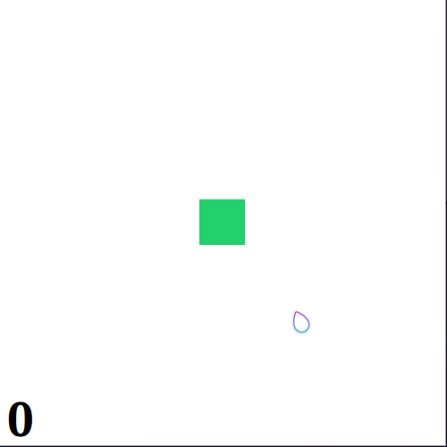

# Problem Set 4

## Instructions
The homework PDF has all the basic instructions, but here are some additional guidelines:
 - [ ] Code for Problem 1 should be done in the `Prob1.py` file already in the repository. 
 - [ ] Code for Problem 2 should be done in the `Prob2.py` file already in the repository. 
 - [ ] Code for Problem 3 should be done in the `Prob3.py` file already in the repository. An animation of a working version of Problem 3 can be seen below:
       

#### Testing
Due to the graphical nature of all of these problems, I can not easily write autotests to help you check your work. You'll just need to carefully read the PDF to ensure you are meeting all requirements.
